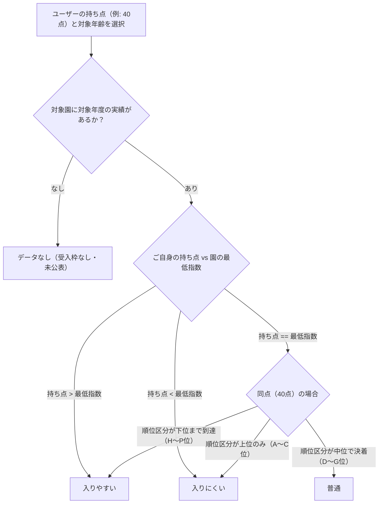

# ぴったり保育園（中央区保活支援オープンソース）

> **「保活の散らばる情報をひとつにまとめ、持ち点に合わせて探せるWebアプリ」**  
> 本リポジトリは、**東京都中央区**の保育施設・利用調整（選考）ルールに特化して構築されたオープンソースWebアプリケーションです。  
> 同様の課題を抱える他自治体（市区町村）のシビックテック、自治体職員、議員、市民エンジニアがゼロから立ち上げ・横展開できるよう、システム設計・具体的な情報ソース・データ収集パイプラインをすべて公開しています。

[](https://yukihoz.github.io/pittari-hoikuen/)
[](LICENSE)
[](https://github.com/yukihoz/pittari-hoikuen)

---

> [!IMPORTANT]
> ### ⚠️ 他自治体への横展開にあたっての重要なお知らせ（自治体による情報公開格差について）
> **本システムは「東京都中央区」の公表データ・選考ルールに特化して設計・実装されています。**
> 
> 各自治体における保活情報の公開度（オープンデータ推進度）には非常に大きな地域格差があります：
> 1. **選考結果の公開格差**: 中央区では「最低指数（ボーダー点）」に加え、同点時の優先順位を可視化する「最終内定順位区分（A〜P区分）」まで公表されていますが、自治体によっては最低指数すら非公開であったり、同点内順位の公表がない場合も多くあります。
> 2. **設備・日常負担の公開格差**: 中央区では入園案内パンフレットの巻末等に、園庭・駐輪場所・ベビーカー置場・おむつ処理方針などの設備調査が詳細にまとまっていますが、他自治体ではこれらの情報が存在しない（未調査・非公開）場合があります。
> 
> **他自治体で同様のサイトを構築される際は、中央区と同等の情報が存在しない（取得できない）場合があることをあらかじめご留意ください。**  
> その場合、手に入らない項目を非表示にする、指数判定ロジックを最低指数のみの判定に簡素化するなど、対象自治体の公表実態に合わせて柔軟にカスタマイズしてご活用ください。

---

## 1. サービスの概要と解決する課題

### 課題：保活における「情報の分散と非効率」
保育園を探す保護者（保活家庭）は、以下のような多種多様な情報を別々の資料から集めて比較しなければなりませんでした：
1. **施設の基本情報**: 定員、面積、開園時間、場所（区のHPやバラバラのPDF）
2. **日々の負担**: おむつサブスクの有無、使用済みおむつ持ち帰り、布団シーツ、駐輪場、ベビーカー置場、連絡アプリ（見学時のメモや口コミ）
3. **入園の難易度（利用調整結果）**: 「持ち点〇〇点で入れるか？」（過去の利用調整結果PDF、最低指数・同点内順位など）
4. **保育の質**: 東京都の第三者評価（福ナビ）や指導検査結果

### 解決策：「ぴったり保育園」の提供価値
* **リアルタイム難易度シミュレーション**: 「入園時の年齢」と「家庭の持ち点（保活指数：例 40点）」を選ぶだけで、各園の直近実績に基づく受かりやすさ（入りやすい／普通／入りにくい／データなし）を即座に判定。
* **設備・負担の一覧比較**: 園庭、駐輪場所、ベビーカー置場、連絡アプリ、医療的ケア受入などの設備有無を黄色／グレーで統一表示（情報のない認可外園等は自動非表示）。最大3園の横並び詳細比較も可能。
* **完全静的Webサイト（Zero Server Cost）**: データベースやサーバーサイドAPIを持たず、ブラウザ側（Vanilla JS）だけで高速動作。GitHub PagesやCloudflare Pages等の無料ホスティングで月額0円・保守フリーで運用可能。

---

## 2. ディレクトリ構成

```text
.
├── dist/                      # 公開用静的Webサイト一式（GitHub Pages / Cloudflare Pagesの公開ルート）
│   ├── index.html             # メインUI（SPAシェル）
│   ├── styles.css             # 全スタイル（レスポンシブ、CSS変数、アクセントカラー）
│   ├── app.js                 # UI操作・リアルタイム絞り込み・ソート・比較ロジック
│   ├── data.js                # 施設マスターデータ（window.NURSERY_DATA）
│   ├── admission-data.js      # 過年度の利用調整指数データ（window.ADMISSION_DATA）
│   ├── evaluations.js         # 第三者評価データ（window.EVALUATIONS_DATA）
│   └── profile.png            # 企画・開発者アイコン
├── data/                      # 元データ・中間生成ファイル
│   ├── pdf/                   # 自治体が公表したPDF原本（利用調整結果、保育園のご案内）
│   ├── admission_index_by_nursery_age.csv # 抽出した年度別指数CSV
│   └── admission_index_consolidated.json # 統合済み指数JSON
├── scripts/                   # データ収集・抽出・加工用Pythonスクリプト群
│   ├── extract_nurseries.py   # 施設基本情報・設備情報の抽出・スクレイピング
│   ├── extract_admission_index.py # 利用調整結果PDFからの指数抽出
│   ├── build_consolidated_admission_data.py # 過年度データの統合と難易度構築
│   ├── extract_fukunavi.py    # 福ナビ（第三者評価）データの取得・抽出
│   └── export_admission_data.py # dist向けJSファイル（window変数）の書き出し
├── .github/workflows/         # 自動デプロイワークフロー（GitHub Actions）
├── LICENSE                    # MITライセンス
├── README.md                  # 本ドキュメント
└── CHANGELOG.md               # 更新履歴
```

---

## 3. 東京都中央区の情報ソース一覧と取得・整理方法

本プロジェクトで実際に取得・解析している東京都中央区の一次情報ソースURLです。

### ① 施設基本情報 & 設備データ
| 項目 | 具体的な取得先ソース（中央区） | 取得方法・整理手法 |
| :--- | :--- | :--- |
| **認可保育所 利用案内・申込書原本** | [中央区公式HP: 認可保育所等利用案内](https://www.city.chuo.lg.jp/a0021/kosodate/kosodate/hoikuen/hoiku/ninkahoiku/ninkahoikujo.html#cms1614F)<br>原本PDF: [令和8年度保育園のごあんない (PDF)](https://www.city.chuo.lg.jp/documents/16297/r8goannnai.pdf) | 表形式のパンフレットPDFから定員・延床面積・園庭面積・職員数などを抽出。 |
| **施設一覧・受入状況** | [中央区公式HP: 認可保育所 施設案内](https://www.city.chuo.lg.jp/kosodate/kosodate/hoikuen/hoiku/ninkahoiku/ninkahoikuensisetsuannai/index.html) | 各施設の住所、電話番号、運営事業者名、開設時期等を収集。 |
| **設備・日々の持ち物負担** | 「令和8年度 保育園のごあんない」巻末一覧表 | おむつサブスク、使用済みおむつ処分、布団シーツ、駐輪スペース、ベビーカー置場、連絡アプリ、医療的ケア受入などの有無をデータ化。 |
| **地域型保育事業（小規模・事業所内）** | [中央区公式HP: 地域型保育事業一覧](https://www.city.chuo.lg.jp/kosodate/hoiku/tiikigata/syoukibohoikujigyou.html) | 認可枠として選考対象となる小規模保育所・事業所内保育所の基本情報を抽出。 |
| **認証保育所一覧** | [中央区公式HP: 認証保育所一覧](https://www.city.chuo.lg.jp/a0021/kosodate/kosodate/hoikuen/hoiku/ninnshouhoikujo/index.html) | 東京都認証保育所の基本情報・定員を収集。 |
| **認可外・企業主導型保育事業** | [中央区公式HP: 企業主導型保育事業・認可外施設](https://www.city.chuo.lg.jp/a0021/kosodate/kosodate/hoikuen/hoiku/ninkagaihoiku/kigyou.html) | 無償化対象施設を含む認可外・企業主導型保育事業の情報を収集。 |

### ② 利用調整結果（過去の選考ボーダー指数）
中央区では毎年2月に4月第1回利用調整結果が公表されます。

| 項目 | 具体的な取得先ソース（中央区） | 整理手法 |
| :--- | :--- | :--- |
| **利用調整結果・空き状況** | [中央区公式HP: 保育園等の空き状況・利用調整結果](https://www.city.chuo.lg.jp/a0021/kosodate/kosodate/hoikuen/hoiku/ninkahoiku/akizyoukyou.html) | 過去複数年（令和4年〜令和8年）のPDFをアーカイブ・蓄積。 |
| **内定最低指数 & 最終順位区分表** | 過去の4月1日付利用調整結果（最終順位区分表PDF） | 各園・各年齢クラスごとの「最低指数」および「最終内定順位（A〜P区分）」を抽出。 |

### ③ 第三者評価データ
| 項目 | 具体的な取得先ソース | 整理手法 |
| :--- | :--- | :--- |
| **福祉サービス第三者評価（福ナビ）** | [とうきょう福祉ナビゲーション（福ナビ）: 中央区・認可保育所](https://www.fukunavi.or.jp/fukunavi/controller?actionID=hyk&cmd=hyklst&S_MODE=area&SVCDBR_CD=22&MLT_AREA=13102&MODE=multi&STEP_SVCSBRCD=031) | 各園の評価受審有無、受審年度、利用者アンケート満足度、共通評価項目（安全対策、家庭との信頼等）をスクレイピング抽出。 |

---

## 4. データ抽出・加工パイプライン

### PDFからの表抽出テクニック（難関ポイントと解決策）
自治体が公開する利用調整結果や施設案内PDFは、スキャン画像または複雑なレイアウトの表形式であることが大半です。本プロジェクトでは以下の手法で高精度にデータ化しています：

1. **ベクターPDFの場合（文字情報が埋め込まれているPDF）**:
   - `scripts/extract_admission_index.py` では、PDFの表の「列のX座標範囲」を年度ごとに定義し、各テキスト要素のバウンディングボックス（X, Y座標）を判定して正確にセル単位で抽出します。
   - ライブラリとしては `pdfplumber`、`pypdf`、あるいは `pdftocairo` によるSVG/XML化解析が有効です。
2. **施設名の表記ゆらぎ吸収（エイリアス管理）**:
   - 施設案内と利用調整結果で、園名が微妙に異なるケースが頻発します（例: `ポピンズ` と `ﾎﾟﾋﾟﾝｽﾞ`、`（本園）`の有無、株式会社の省略、園名変更など）。
   - `scripts/build_consolidated_admission_data.py` の `ALIASES` 辞書のように、正規化関数（NFKC正規化、空白・記号除去）と手動名寄せマップを組み合わせて確実にマスターと紐付けます。

```python
# 例：文字正規化関数
def norm(n):
    if not n: return ""
    s = unicodedata.normalize('NFKC', n)
    s = re.sub(r'[\s　・\(\)（）\n\-\_]', '', s)
    return s
```

---

## 5. 入園難易度の判定ロジック設計（中央区モデル）

本アプリの核となる「持ち点によるリアルタイム難易度判定」は以下のロジックに基づいています：



> **自治体に応じたカスタマイズのポイント**:
> * **点数基準の違い**: 中央区ではフルタイム共働きが「20点＋20点＝40点」ですが、自治体によっては「100点＋100点＝200点」や「10点＋10点＝20点」など全く異なります。スライダーの最小・最大値や判定の基準点を調整してください。
> * **順位区分の有無**: 同点順位区分が公表されていない自治体の場合は、「持ち点 > 最低点 → 入りやすい」「持ち点 == 最低点 → 普通」「持ち点 < 最低点 → 入りにくい」の3区分で簡潔に判定するのが実用的です。

---

## 6. 他自治体への横展開（フォーク＆構築手順）

ご自身の自治体向けに「ぴったり保育園」を構築する手順です：

### ステップ1：リポジトリをフォーク
本リポジトリを GitHub で Fork またはクローンします。

### ステップ2：施設マスター（`dist/data.js`）の作成
自治体の保育施設リストを以下のJSON構造で作成し、`window.NURSERY_DATA = [...]` として `dist/data.js` に配置します。
（※設備データが存在しない施設は、`bicycle` などのプロパティを `null` または `undefined` にしておけば、UI上で自動的にアイコンが非表示になります。）

```javascript
// dist/data.js の主要データ構造（スキーマ）
{
  "id": "licensed-1",                // 一意なID（認可: licensed-〇, 認証: certified-〇 等）
  "number": 1,                       // 施設番号
  "name": "〇〇保育園",               // 施設名
  "category": "認可保育園・こども園",   // 施設区分（認可保育園・こども園 / 認証保育所 / 認可外・企業主導型 / その他）
  "type": "認可保育所",               // 種別詳細
  "area": "日本橋",                  // エリア区分（自治体の地区・中学校区など）
  "operator": "社会福祉法人〇〇",      // 設置・運営事業者
  "address": "東京都中央区〇〇1-2-3",  // 所在地
  "lat": 35.68, "lng": 139.77,       // 緯度経度（地図リンク用）
  "opened": "2018-04-01",            // 開設年月日
  "floorArea": 650.5,                // 延床面積（㎡）
  "areaPerChild": 8.5,               // 児童1人あたり延床面積（㎡）
  "capacity": {                      // 年齢別定員
    "57d": 6, "7m": 0, "age1": 10, "age2": 12, "age3": 15, "age4": 15, "age5": 15, "total": 73
  },
  "gardenLabel": "あり（敷地内）",     // 園庭の有無表記
  "gardenArea": 120.0,               // 園庭面積（㎡）
  "bicycle": "あり",                  // 駐輪スペース（あり / なし / 未定義）
  "stroller": "あり",                 // ベビーカー置場（あり / なし / 未定義）
  "diaperPrep": "園(無料)",           // おむつ準備（園(無料) / 保護者 / 園/サブスク選択可 等）
  "contactApp": "あり",               // 連絡アプリ
  "medicalCare": "あり"               // 医療的ケア児受入
}
```

### ステップ3：利用調整結果（`dist/admission-data.js`）の作成
自治体公表の利用調整結果から、過去年度の指数データを `window.ADMISSION_DATA = [...]` として配置します。

```javascript
// dist/admission-data.js のデータ構造
{
  "id": "licensed-1",
  "name": "〇〇保育園",
  "historicalDifficulty": {
    "2026": { "score": 40, "rank": "K", "raw": "40点(K)" }, // 直近実績
    "2025": { "score": 40, "rank": "J", "raw": "40点(J)" },
    "2024": { "score": 40, "rank": "H", "raw": "40点(H)" }
  }
}
```

### ステップ4：表示設定のカスタマイズ（`dist/index.html` & `dist/app.js`）
* **自治体名・年度の書き換え**: `index.html` 内のタイトル、ヘッダー、フッターの文言をご自身の自治体（例: 「世田谷区 2027」等）に変更。
* **エリア（地区）の変更**: 自治体の地域区分（例: 「東部」「西部」や生活圏別）に合わせてチェックボックスの選択肢を変更。
* **指数のレンジ変更**: 自治体の指数体系に合わせてスライダーの `min`, `max`, 初期値（`state.userScore`）を変更。

### ステップ5：GitHub Pages または Cloudflare Pages でデプロイ
* **GitHub Pages**: リポジトリの `Settings` → `Pages` で、Branch: `main`、Folder: `/dist` を選択して保存。
* **Cloudflare Pages**: Cloudflareダッシュボードでリポジトリを連携し、ビルド出力ディレクトリに `dist` を指定するだけ（完全無料・独自ドメイン対応）。

---

## 7. 技術スタック

* **フロントエンド**: HTML5, CSS3 (Modern CSS Grid / Flexbox / Variables), Vanilla JavaScript (ES6+)
  * フレームワーク・外部依存ライブラリ非依存（超軽量・高速描画）
  * Material Symbols (Google Fonts)
* **データ抽出・前処理**: Python 3.10+
  * `pdfplumber`, `pypdf`, `cairosvg`
* **ホスティング環境**: GitHub Pages / Cloudflare Pages

---

## 8. 企画・クレジット

* **企画・データ整理**: ほづみゆうき（東京都中央区議会議員 / Code for Chuo代表）
  * 元文部科学省、福祉系NPOシステム＆政策提言担当。待機児童の早期解消や子育てしやすい中央区の実現を目指し、継続的にデータ分析と情報発信を実施。
* **協力コミュニティ**: [Code for Chuo](https://github.com/yukihoz)
* **ライセンス**: 本リポジトリのソースコードおよび構成は **MIT License** で公開しています。他の自治体の皆様、シビックテック、保活支援を行いたいすべての個人・団体の自由な活用・改変・再配布を歓迎します。
