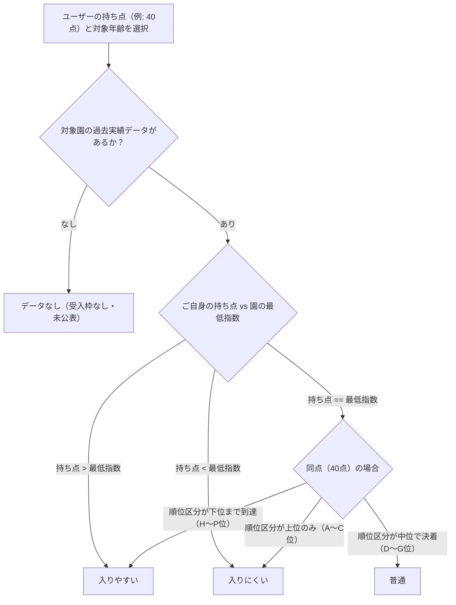

# ぴったり保育園（中央区保活支援オープンソース）

> **「保活の散らばる情報をひとつにまとめ、持ち点に合わせて探せるWebアプリ」**  
> 東京都中央区の実績をもとに、他自治体（市区町村）でも同様の保活支援サービスをゼロから立ち上げ・横展開できるよう、アーキテクチャ・情報ソースの取得方法・データパイプラインをすべて公開しています。

[](https://yukihoz.github.io/pittari-hoikuen/)
[](LICENSE)
[](https://github.com/yukihoz/pittari-hoikuen)

---

## 1. サービスの概要と解決する課題

### 課題：保活における「情報の分散と非効率」
保育園を探す保護者（保活家庭）は、以下のような多種多様な情報を別々の資料から集めて比較しなければなりませんでした：
1. **施設の基本情報**: 定員、面積、開園時間、場所（区のHPやバラバラのPDF）
2. **日々の負担**: おむつサブスクの有無、使用済みおむつ持ち帰り、布団シーツ、駐輪場、ベビーカー置場、連絡アプリ（見学時のメモや口コミ）
3. **入園の難易度（利用調整結果）**: 「持ち点〇〇点で入れるか？」（過去の利用調整結果PDF、最低指数・同点内順位など）
4. **保育の質**: 東京都の第三者評価（福ナビ）や指導検査結果

### 解決策：「ぴったり保育園」の提供価値
* **リアルタイム難易度シミュレーション**: 「入園時の年齢」と「家庭の持ち点（保活指数：例 40点）」を選ぶだけで、各園の直近実績に基づく受かりやすさ（入りやすい／普通／入りにくい／データなし）を即座に判定。
* **設備・負担の一覧比較**: 園庭、駐輪場所、ベビーカー置場、連絡アプリ、医療的ケア受入などの設備有無を黄色／グレーで統一表示。最大3園の横並び詳細比較も可能。
* **完全静的Webサイト（Zero Server Cost）**: データベースやサーバーサイドAPIを持たず、ブラウザ側（Vanilla JS）だけで高速動作。GitHub PagesやCloudflare Pages等の無料ホスティングで月額0円・保守フリーで運用可能。

---

## 2. ディレクトリ構成

```text
.
├── dist/                      # 公開用静的Webサイト一式（GitHub Pages / Cloudflare Pagesの公開ルート）
│   ├── index.html             # メインUI（SPAシェル）
│   ├── styles.css             # 全スタイル（レスポンシブ、CSS変数、アクセントカラー）
│   ├── app.js                 # UI操作・リアルタイム絞り込み・ソート・比較ロジック
│   ├── data.js                # 施設マスターデータ（window.NURSERY_DATA）
│   ├── admission-data.js      # 過年度の利用調整指数データ（window.ADMISSION_DATA）
│   ├── evaluations.js         # 第三者評価データ（window.EVALUATIONS_DATA）
│   └── profile.png            # 企画・開発者アイコン
├── data/                      # 元データ・中間生成ファイル
│   ├── pdf/                   # 自治体が公表したPDF原本（利用調整結果、保育園のご案内）
│   ├── admission_index_by_nursery_age.csv # 抽出した年度別指数CSV
│   └── admission_index_consolidated.json # 統合済み指数JSON
├── scripts/                   # データ収集・抽出・加工用Pythonスクリプト群
│   ├── extract_nurseries.py   # 施設基本情報・設備情報の抽出・スクレイピング
│   ├── extract_admission_index.py # 利用調整結果PDFからの指数抽出
│   ├── build_consolidated_admission_data.py # 過年度データの統合と難易度構築
│   ├── extract_fukunavi.py    # 福ナビ（第三者評価）データの取得・抽出
│   └── export_admission_data.py # dist向けJSファイル（window変数）の書き出し
├── .github/workflows/         # 自動デプロイワークフロー（GitHub Actions）
└── CHANGELOG.md               # 更新履歴
```

---

## 3. 情報ソース一覧と取得・整理方法

他自治体で同様のサイトを立ち上げる場合、各自治体の公式公表物から以下の3系統のデータを収集・整理します。

### ① 施設基本情報 & 設備データ
| 項目 | 取得先ソース | 取得方法・整理手法 |
| :--- | :--- | :--- |
| **施設名・種別・住所・電話・運営者** | 自治体公式HP「保育施設一覧」またはオープンデータカタログ | CSV/Excelが公開されている自治体は直接利用。ない場合はWebページまたはPDF「保育施設のご案内」から抽出。 |
| **年齢別定員・延床面積・園庭面積** | 「令和〇年度 保育施設のご案内」（入園案内パンフレットPDF） | 表形式のパンフレットPDFから抽出（後述のPDF抽出技術を活用）。 |
| **おむつ・布団・駐輪・ベビーカー・アプリ** | 自治体独自の「認可保育園施設一覧」「受入状況比較表」またはアンケート調査 | 自治体によっては保育案内パンフレットの巻末に「持参物・日々の準備一覧」や「ベビーカー・駐輪可否一覧表」がまとまっています。 |

### ② 利用調整結果（過去の選考ボーダー指数）
各自治体は毎年2月〜3月頃に「4月入園（第1回）利用調整結果」を公表します。

| 項目 | 取得先ソース | 整理手法 |
| :--- | :--- | :--- |
| **最低指数（ボーダー点）** | 「令和〇年4月入園 利用調整結果（最低指数一覧）」PDF | 0歳〜5歳各クラスの最低内定点数を年度別（過去3〜5年分）に抽出。 |
| **同点内優先順位（内定順位）** | 「利用調整結果における最終順位区分表（A〜P区分など）」 | フルタイム同点（例: 40点）が多数を占める自治体では、最低指数だけでは合否が見えません。内定者の順位（上位・中位・下位）も合わせて取得します。 |

### ③ 第三者評価・外部評価データ（任意）
* **東京都の場合**: [とうきょう福祉ナビゲーション（福ナビ）](https://www.fukunavi.or.jp/) に認可保育所の第三者評価結果（利用者満足度アンケート結果、子どもの気持ちの尊重、安全対策など）が公表されています。
* **他道府県の場合**: 各都道府県の福祉サービス第三者評価推進機関または [WAM NET（ワムネット）](https://www.wam.go.jp/) から評価公表データを取得可能です。

---

## 4. データ抽出・加工パイプライン

### PDFからの表抽出テクニック（難関ポイントと解決策）
自治体が公開する利用調整結果や施設案内PDFは、スキャン画像または複雑なレイアウトの表形式であることが大半です。本プロジェクトでは以下の手法で高精度にデータ化しています：

1. **ベクターPDFの場合（文字情報が埋め込まれているPDF）**:
   - `scripts/extract_admission_index.py` では、PDFの表の「列のX座標範囲」を定義し、各テキスト要素のバウンディングボックス（X, Y座標）を判定して正確にセル単位で抽出します。
   - ライブラリとしては `pdfplumber`、`pypdf`、あるいは `pdftocairo` によるSVG/XML化解析が有効です。
2. **施設名の表記ゆらぎ吸収（エイリアス管理）**:
   - 施設案内と利用調整結果で、園名が微妙に異なるケースが頻発します（例: `ポピンズ` と `ﾎﾟﾋﾟﾝｽﾞ`、`（本園）`の有無、株式会社の省略、園名変更など）。
   - `scripts/build_consolidated_admission_data.py` の `ALIASES` 辞書のように、正規化関数（NFKC正規化、空白・記号除去）と手動名寄せマップを組み合わせて確実にマスターと紐付けます。

```python
# 例：文字正規化関数
def norm(n):
    if not n: return ""
    s = unicodedata.normalize('NFKC', n)
    s = re.sub(r'[\s　・\(\)（）\n\-\_]', '', s)
    return s
```

---

## 5. 入園難易度の判定ロジック設計

本アプリの核となる「持ち点によるリアルタイム難易度判定」は以下のロジックに基づいています：



> **カスタマイズのポイント**:
> フルタイム共働きの標準持ち点（中央区は40点、他自治体では20点や100点など基準が異なります）に合わせて、スライダーのレンジ（`min`/`max`）や判定境界の閾値を設定してください。

---

## 6. 他自治体への横展開（フォーク＆構築手順）

ご自身の自治体向けに「ぴったり保育園」を構築する手順です：

### ステップ1：リポジトリをフォーク
本リポジトリを GitHub で Fork またはクローンします。

### ステップ2：施設マスター（`dist/data.js`）の作成
自治体の保育施設リストを以下のJSON構造で作成し、`window.NURSERY_DATA = [...]` として `dist/data.js` に配置します。

```javascript
// dist/data.js の主要データ構造（スキーマ）
{
  "id": "licensed-1",                // 一意なID（認可: licensed-〇, 認証: certified-〇 等）
  "number": 1,                       // 施設番号
  "name": "〇〇保育園",               // 施設名
  "category": "認可保育園・こども園",   // 施設区分（認可保育園・こども園 / 認証保育所 / 認可外・企業主導型 / その他）
  "type": "認可保育所",               // 種別詳細
  "area": "日本橋",                  // エリア区分（自治体の地区・中学校区など）
  "operator": "社会福祉法人〇〇",      // 設置・運営事業者
  "address": "東京都中央区〇〇1-2-3",  // 所在地
  "lat": 35.68, "lng": 139.77,       // 緯度経度（地図リンク用）
  "opened": "2018-04-01",            // 開設年月日
  "floorArea": 650.5,                // 延床面積（㎡）
  "areaPerChild": 8.5,               // 児童1人あたり延床面積（㎡）
  "capacity": {                      // 年齢別定員
    "57d": 6, "7m": 0, "age1": 10, "age2": 12, "age3": 15, "age4": 15, "age5": 15, "total": 73
  },
  "gardenLabel": "あり（敷地内）",     // 園庭の有無表記
  "gardenArea": 120.0,               // 園庭面積（㎡）
  "bicycle": "あり",                  // 駐輪スペース（あり / なし / 未定義）
  "stroller": "あり",                 // ベビーカー置場（あり / なし / 未定義）
  "diaperPrep": "園(無料)",           // おむつ準備（園(無料) / 保護者 / 園/サブスク選択可 等）
  "contactApp": "あり",               // 連絡アプリ
  "medicalCare": "あり"               // 医療的ケア児受入
}
```

### ステップ3：利用調整結果（`dist/admission-data.js`）の作成
過去の利用調整結果を抽出し、`window.ADMISSION_DATA = [...]` として配置します。

```javascript
// dist/admission-data.js のデータ構造
{
  "id": "licensed-1",
  "name": "〇〇保育園",
  "historicalDifficulty": {
    "2026": { "score": 40, "rank": "K", "raw": "40点(K)" }, // 直近実績
    "2025": { "score": 40, "rank": "J", "raw": "40点(J)" },
    "2024": { "score": 40, "rank": "H", "raw": "40点(H)" }
  }
}
```

### ステップ4：表示設定のカスタマイズ（`dist/index.html` & `dist/app.js`）
* **エリアの選択肢**: 自治体の地域名（例: 「東地区」「西地区」「南地区」など）に変更。
* **指数の設定**: 自治体の基本指数に合わせてスライダーの点数を調整（例: 38〜43点 → 18〜24点など）。
* **ヘッダー・フッター文言**: 自治体名や年度表記を書き換え。

### ステップ5：GitHub Pages または Cloudflare Pages でデプロイ
* **GitHub Pages**: リポジトリの `Settings` → `Pages` で、Branch: `main`、Folder: `/dist` を選択して保存。
* **Cloudflare Pages**: Cloudflareダッシュボードでリポジトリを連携し、ビルド出力ディレクトリに `dist` を指定するだけ（完全無料・独自ドメイン対応）。

---

## 7. 技術スタック

* **フロントエンド**: HTML5, CSS3 (Modern CSS Grid / Flexbox / Variables), Vanilla JavaScript (ES6+)
  * フレームワーク・外部依存ライブラリ非依存（超軽量・高速描画）
  * Material Symbols (Google Fonts)
* **データ抽出・前処理**: Python 3.10+
  * `pdfplumber`, `pypdf`, `cairosvg`
* **ホスティング環境**: GitHub Pages / Cloudflare Pages

---

## 8. 企画・クレジット

* **企画・データ整理**: ほづみゆうき（東京都中央区議会議員 / Code for Chuo代表）
  * 元文部科学省、福祉系NPOシステム＆政策提言担当。待機児童の早期解消や子育てしやすい中央区の実現を目指し、継続的にデータ分析と情報発信を実施。
* **協力コミュニティ**: [Code for Chuo](https://github.com/yukihoz)
* **ライセンス**: 本リポジトリのソースコードおよび構成は **MIT License** で公開しています。他の自治体の皆様、シビックテック、保活支援を行いたいすべての個人・団体の自由な活用・改変・再配布を歓迎します。
